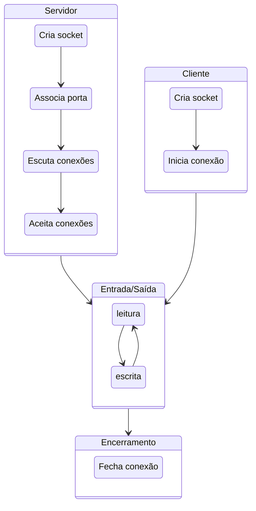
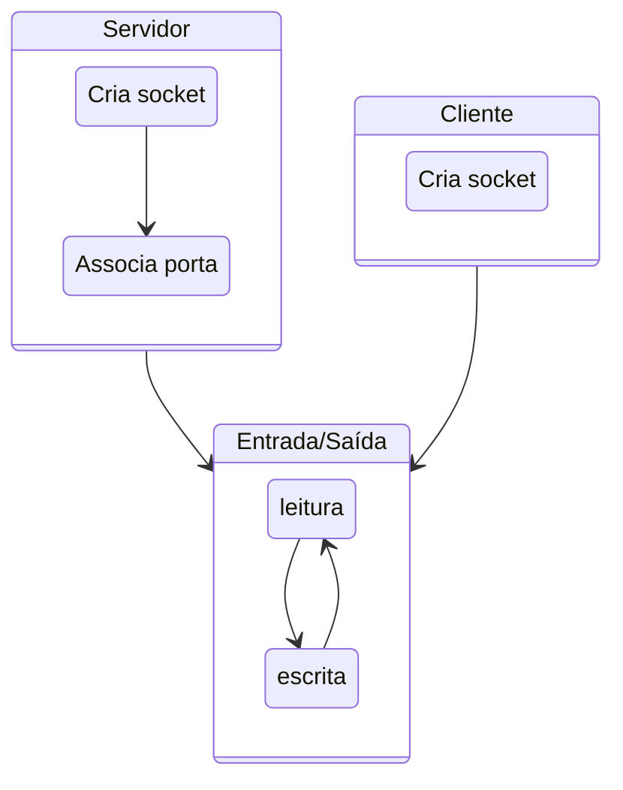

Releia [aqui](../../comm/sockets/) material sobre sockets antes de continuar.

A API usada para estabelecer a conversa via socket tem várias chamadas, que devem ser executadas na ordem certa no processo iniciando a conversa e naquele que aceita participar da mesma. Comecemos estudando o TCP.

## TCP

O fluxograma da criação de um socket TCP é apresentado na seguinte figura:


<!---->

Estabelecido o socket, o mesmo pode ser usado como um **arquivo**, isto é, lendo-se e escrevendo-se bytes.
O que exatamente deve ser escrito e como o que é lido deve ser interpretado é o protocolo da camada 7, **sua responsabilidade**.

Considere o exemplo do uso de sockets, em Python, descrito no arquivo`server.py`.[^pyname]
Ele será utilizado como base para as atividades apresentadas na sequência.

[^pyname]:Você pode usar outro nome, desde que não seja `socket.py`, e que adapte o comando para sua execução.

```python
#server.py
#!/usr/bin/python                           # This is server.py file

import socket                               # Import socket module

s = socket.socket()                         # Create a socket object
host = socket.gethostname()	                # Get local machine name
port = 12345                                # Reserve a port for your service.
s.bind((host, port))                        # Bind to the port

s.listen(5)                                 # Now wait for client connections.
while True:
   c, addr = s.accept()                     # Establish connection with client.
   print('Got connection from', addr)
   c.send('Thank you for connecting'.encode())
   c.close()                                # Close the connection
```

Para executá-lo, execute o seguinte comando em um terminal. 

```bash
python server.py
```

Em outro terminal, execute **um dos** dois comandos a seguir. [^telnet]

[^telnet]:O programa `telnet` é normalmente instalado por padrão tanto no Windows, OSX quanto no Linux. Já o `netcat` normalmente precisa ser instalado por você. Em alguns sistemas, em vez de `netcat` o comando é o `nc`.

```bash
telnet localhost 12345
```

```bash
netcat localhost 12345
```

Por completude, vamos também escrever o código do cliente, agora que você já sabe que o servidor funciona.
Do lado cliente, estabelece-se uma conexão apontando-se para onde está o servidor.
```Python
#client.py

#!/usr/bin/python                      # This is client.py file

import socket                          # Import socket module

s = socket.socket()                    # Create a socket object
host = socket.gethostname()            # Get local machine name
port = 12345                           # Reserve a port for your service.

s.connect((host, port))
data = s.recv(1024)
print(data.decode())
s.close()                              # Close the socket when done
```

E para se executar o cliente, faça:
```bash
python client.py
```

Observe que o `socket.close()` encerra a conexão do lado de quem invoca. Na contraparte, invocações a `socket.recv()` retornam com 0 bytes lidos.


!!! question "Exercício: Múltiplos Pacotes"
    Façamos agora uma modificação no código do servidor para que envie não uma, mas três mensagens para o cliente, e que o cliente durma um pouco após receber a primeira mensagem. Isto é, modifique seu servidor assim

    ```Python
    ...
    c.send('Thank you for connecting'.encode())
    c.send('Come back often'.encode())
    c.send('Bye!'.encode())
    ```

    Agora execute novamente o cliente e veja o que acontece.  Consegue explicar o fenômeno?

    Modifiquemos o cliente agora, para que tenha três `recv`, assim.
    ```Python
    ...
    from time import sleep
    ...
    print("1")
    data = s.recv(1024)
    print(data.decode())

    sleep(1)

    print("2")
    data = s.recv(1024)
    print(data.decode())
    print("3")
    data = s.recv(1024)
    print(data.decode())
    ...
    ```
    E agora, o que acontece? A saída é como esperava? Como explica este fenômeno e como poderia corrigí-lo?

!!! question "Exercício: Ping-Pong"

    Modifique cliente e servidor tal que o cliente envie uma mensagem passada na linha de comando ao servidor e fique esperando uma resposta, e tal que o servidor fique esperando uma mensagem e então solicite ao operador que digite uma resposta e a envie para o cliente. O loop continua até que o usuário digite SAIR, e a conexão seja encerrada.


    | Terminal 1                 |  Terminal 2 |
    |----------------------------|-------------|
    | python server.py           | python client.py| 
    | Esperando conexão.         | conectando-se ao servidor |
    | Conectado                  | Conectado                 |
    | Esperando mensagem         | Digite mensagem: lalala   |
    |                            | Mensagem enviada          |
    | Mensagem recebida: lalala  | Esperando resposta        |
    | Digite resposta: lelele    |                           |
    | Resposta enviada.          |  Resposta recebida: lelele|
    |                            |  Digite mensagem: SAIR    |
    |                            |  Desconectando.           |
    | Conexão encerrada.         |                           |
    | Esperando conexão.         |                           |
  
    Observe que para ler do teclado em Python 3 seria `#!py3 x = input()`. 


## UDP 

No exemplo anterior, usamos o protocolo TCP (o padrão da API). Caso quiséssemos usar UDP, precisaríamos nos atentar a alguns detalhes.

O fluxograma da criação de um socket UDP é apresentado na seguinte figura:


A criação do socket é feita explicitando-se o uso de **datagramas**: `#!py3 s = socket.socket(socket.AF_INET,socket.SOCK_DGRAM)`

Um servidor UDP não executa `listen` ou `accept` e, em Python, simplesmente executa `#!py3 data, addr = sock.recvfrom(4096)` para receber o datagrama, onde `data` é o conteúdo recebido e  `addr` o endereço de quem enviou o datagrama.

Neste caso, um mesmo socket é usado para manter comunicação com múltiplos interlocutores. Para enviar uma resposta a um interlocutor em específico, `addr` é usado: `#!py3 sent = sock.sendto(data, addr)`, onde `sent` é a quantidade de bytes enviados.

Além deste detalhe, é importante manter em mente outras características do UDP:

* falta de ordem
* falta de confiabilidade
* menos dados lidos que enviados.
* mais dados lidos que enviados (pode acontecer também no TCP)

Com tantas dificuldades para se usar o UDP, fica a questão: **para que serve UDP?**

!!! question "Exercício: Ping-Pong UDP"
    Modifique o código do exercício Ping-Pong para usar UDP em vez de TCP na comunicação entre nós.
    Execute múltiplos clientes ao mesmo tempo. Como o seu servidor lida com isso? Modifique-o para mandar um "eco" da mensagem recebida de volta ao remetente. 


!!! question "Exercício: Confiabilidade UDP"
    Modifique o código do cliente para usar UDP em vez de TCP na comunicação entre nós.
    Em seguida, configure o cliente para enviar 10.000 mensagens.
    Configure o servidor para receber mensagens em um laço infinito, imprimindo a quantidade de mensagens recebidas.
    Execute múltiplos clientes ao mesmo tempo. Como o seu servidor lida com isso?
    Verifique se houve perda de mensagens.


## IP-Multicast

Compare a figuras a seguir, representando conexões TCP para difundir a mesma informação para vários clientes.


Multicast, em oposição ao Unicast, é a capacidade de enviar mensagens para um grupo de destinatários, em vez de apenas um. 


IP-Multicast é uma implementação desta ideia, usando umaa configuração específica do UDP, associada a recursos dos comutadores de rede, para otimizar o envio dos mesmos dados a múltiplos destinatários.
Grupos são identificados por endereços IP especiais, conhecidos como Classe D (224.0.0.0-239.255.255.255), e propagados pela rede.
A seguinte tabela descreve os usos das sub-faixas de endereços.[^multicast_use]
[^multicast_use]:  [Understanding IP Multicast](http://www.dasblinkenlichten.com/understanding-ip-multicast/)

| Endereço | Uso |
|----------|-----|
|224.0.0.0-224.0.0.255| Multicast local - Usado por protocolos L2, como EIGRP e OSPF|
|224.0.1.0-224.0.1.255| Multicast roteaddo - Usado por protocolos L3| 
|232.0.0.0-232.255.255.255| *Source Specific Multicast* - Receptores definem fontes confiáveis|
|233.0.0.0-233.255.255.255| Reservado para detentores *Autonomous Systems* |
|239.0.0.0-239.255.255.255| Reservado para IANA |
|Resto | Uso geral|


Quando um pacote é enviado para o endereço do grupo, **todos** os membros do grupo recebem tal mensagem.
Melhor dizendo, todos os membros podem receber a mensagem, mas como estamos falando de UDP, **é possível que alguns não recebam**.
Além disso, **não há garantia qualquer sobre a ordem de recepção das mensagens**.


!!! question "Exercício: IP-Multicast"
    Implemente e teste o seguinte **receiver**, colocando várias instâncias para executar em múltiplos terminais, ao mesmo tempo.

    ```Python
    import socket
    import struct

    MCAST_GRP = '224.1.1.1'
    MCAST_PORT = 5007

    sock = socket.socket(socket.AF_INET, socket.SOCK_DGRAM, socket.IPPROTO_UDP)
    sock.setsockopt(socket.SOL_SOCKET, socket.SO_REUSEADDR, 1)
    sock.bind(('', MCAST_PORT))
    mreq = struct.pack("=4sl", socket.inet_aton(MCAST_GRP), socket.INADDR_ANY)
    #4 bytes (4s) seguidos de um long (l), usando ordem nativa (=)

    sock.setsockopt(socket.IPPROTO_IP, socket.IP_ADD_MEMBERSHIP, mreq)

    while True:
        print(sock.recv(10240).decode())
    ```

    Implemente e teste o seguinte **sender**.

    ```Python
    import socket

    MCAST_GRP = '224.1.1.1'
    MCAST_PORT = 5007

    sock = socket.socket(socket.AF_INET, socket.SOCK_DGRAM, socket.IPPROTO_UDP)
    sock.setsockopt(socket.IPPROTO_IP, socket.IP_MULTICAST_TTL, 2)
    sock.sendto(input().encode(), (MCAST_GRP, MCAST_PORT))
    ```
